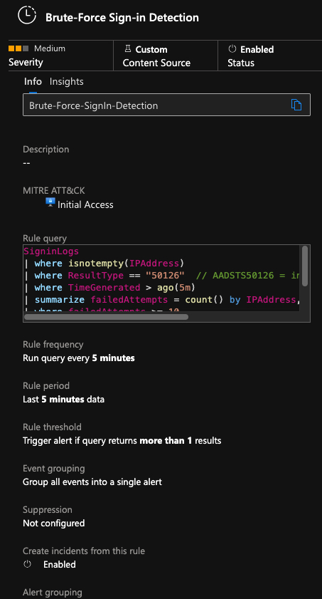

# Project Overview – Azure Sentinel SIEM with Terraform & KQL  

[](https://terraform.io)
[](#)  

This project demonstrates how to detect brute-force login attempts in Azure Active Directory using Microsoft Sentinel.  
The alert rule is provisioned via Terraform and custom KQL query that analyzes failed sign-in events.  

```bash
terraform init
terraform plan -var-file="terraform.tfvars" -out deploy.plan
terraform apply deploy.plan
```  
  
