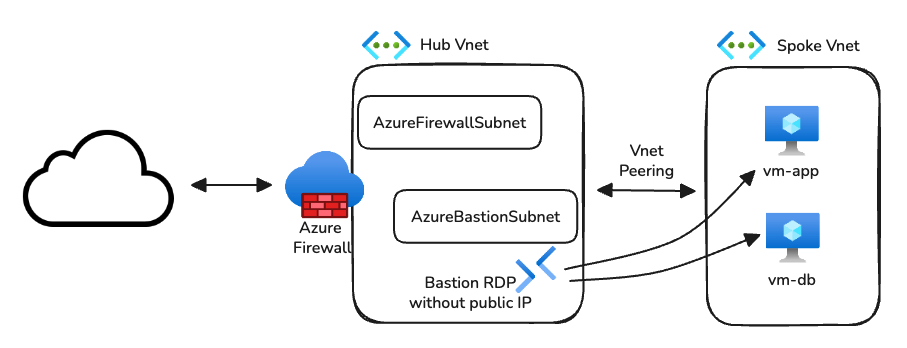

# Azure Hub-and-Spoke Architecture with Zero Trust (Terraform)  

  

This repository implements an enterprise-grade, centralized Hub-and-Spoke network topology in Azure using Terraform, fully aligned with Zero Trust security principles.  

All traffic from workload subnets is forced through Azure Firewall, with no direct internet access. Secure remote access is provided via Azure Bastion.  

  

